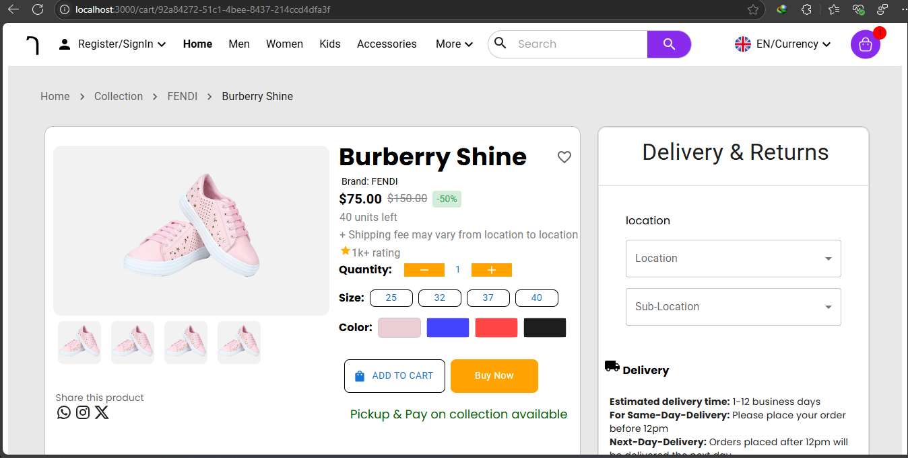
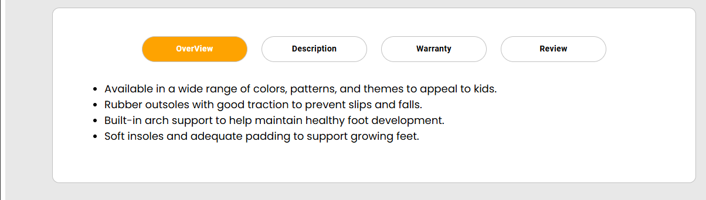
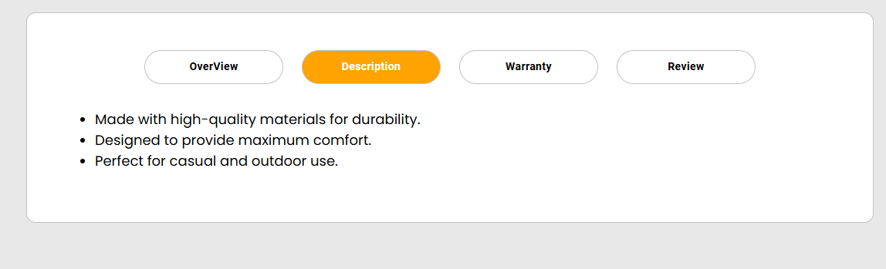
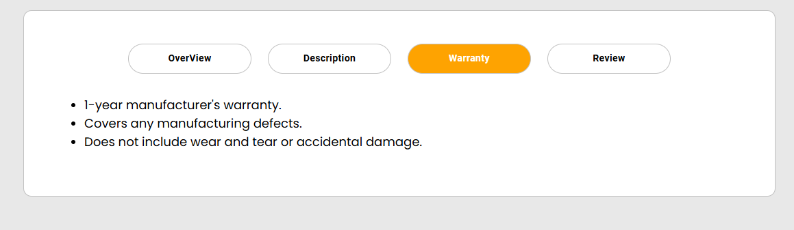
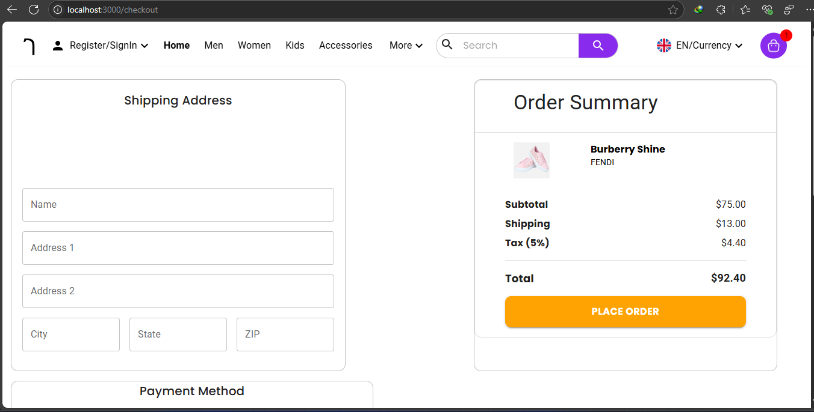
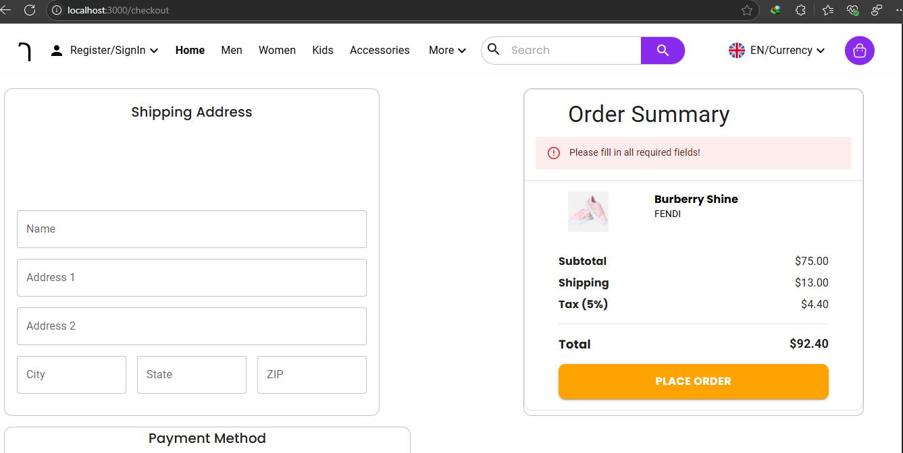
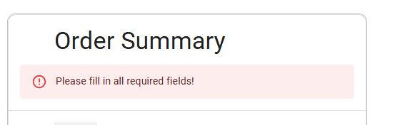
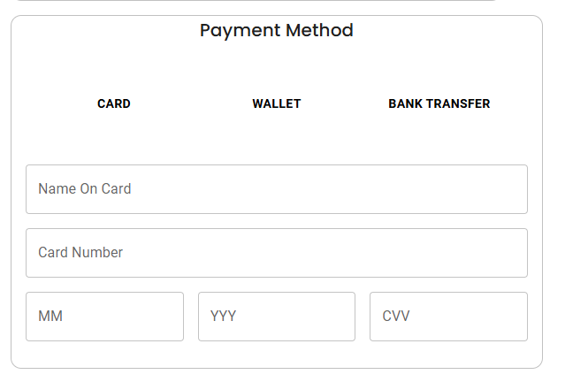

# Gebeya_Market_App
Gebeya Market App
 ## Coming Soon !
 [See Live Demo of my progress here](https://gebeyamarketapp.onrender.com/)

 

# Collection Pages

# Collection Page 

The **Collection Page** is a part of the Gebeya Market app project that allows users to browse products, navigate to the **Cart Details Page** by clicking on images, and add items to the cart using the **"Add to Cart"** button. Functional navigation arrows allow smooth scrolling through the collection.

## Features

- **Product Navigation**: Clicking on product images navigates to the **Cart Details Page**.
- **Add to Cart Functionality**: Adds items to the cart. If the item already exists in the cart, an alert is triggered.
- **Functional Arrows**: Scroll left or right through the collection of products.
# Carts Items Details Page


The **Cart Details Page** provides functionality for users to view their selected items, adjust quantities dynamically, and see real-time price calculations, including the original price and a 50% discounted price.

## Features

- **Dynamic Quantity Adjustment**: Buttons to increase or decrease the quantity of items.
- **Real-Time Price Calculation**: Updates the total price as quantity changes.
- **50% Discount Calculation**: Displays both the original price (strikethrough) and the discounted price.
- **Remove Item from Cart**: Option to remove items from the cart.(on the way)
# Buttons Found On Cart Details Pages are Dynamic



 # Checkout Page - Pricing and Calculation Logic


This project demonstrates a dynamic pricing calculation for an e-commerce checkout page. The subtotal, shipping, tax, and total are automatically calculated based on the selected product price and displayed in a clean, user-friendly format.

## Features

- **Dynamic Subtotal:** Displays the price of the selected product.
- **Shipping Calculation:** 
- **Tax Calculation:** Applies a 5% tax on the subtotal + shipping.
- **Total Calculation:** Automatically updates based on price, shipping, and tax.
## Checkout Pages
## Not filling Neccessary fields the following error displayed

# Error message 


# payment Method is conditional only active when triggered

# Order Summary Upon filling all fields and choosing payment method

# After Submit order

## Prerequisites

- React
- Material-UI (MUI)
# Project Structure
```
root/
├── frontend/
│   ├── src/
│   │   ├── components/
│   │   └── App.jsx
│   │   ├── route.jsx
│   │   ├── index.js
│   │   ├── README.md
│   │   ├── Assets/
│   │   ├── Constants/
│   │   ├── Styles/
│   │   ├── pages/
│   └── public/
